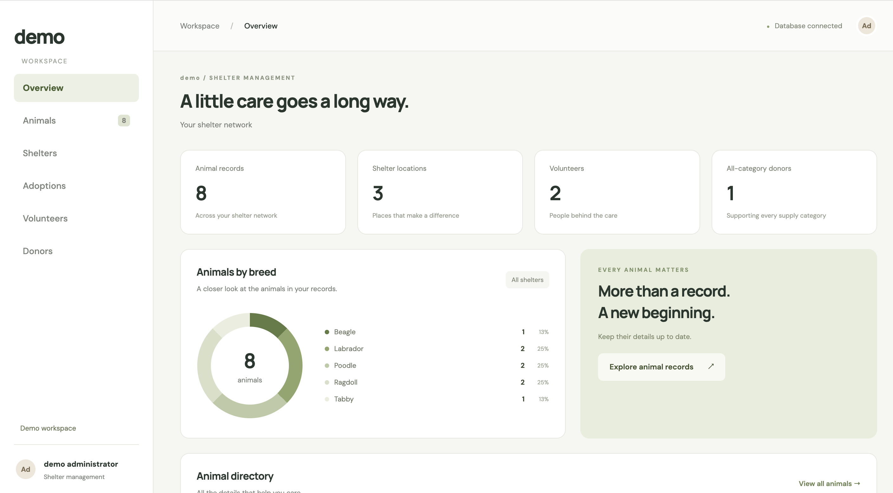
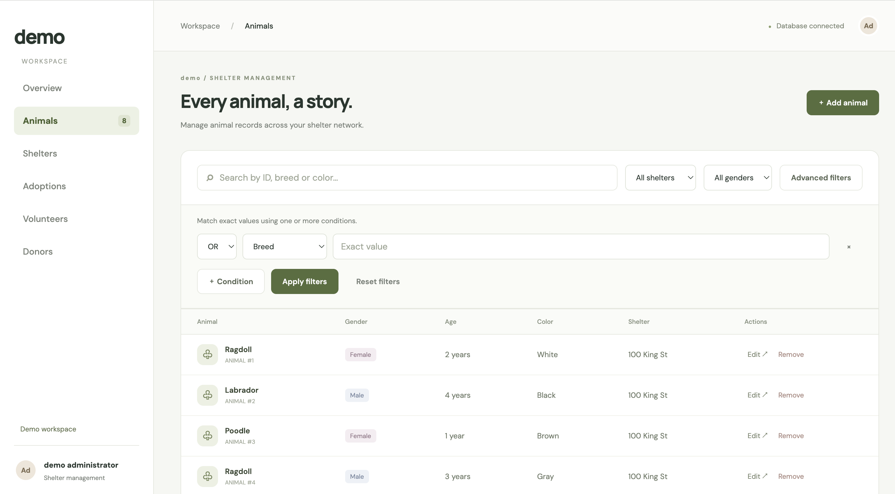
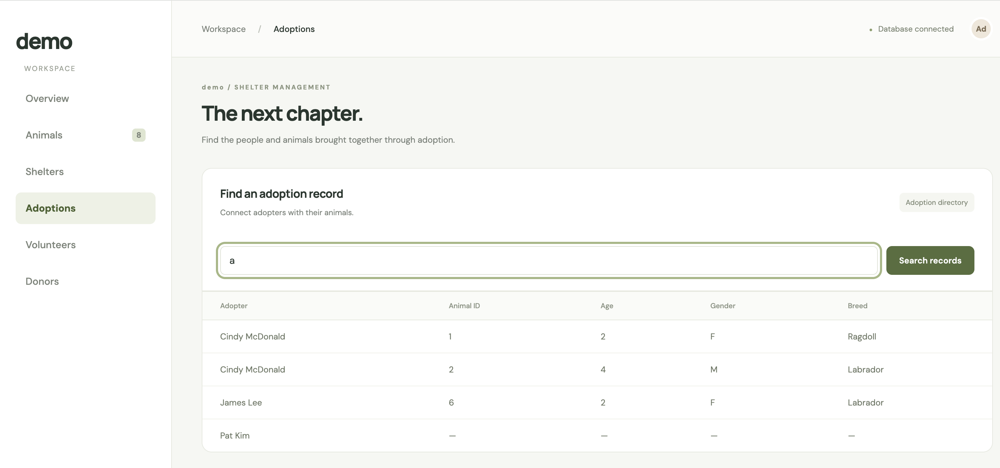
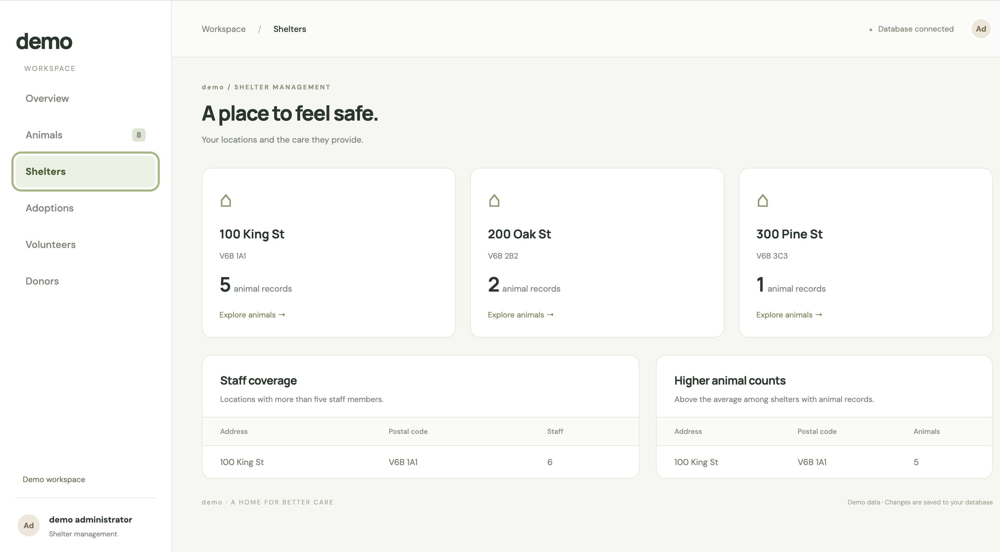
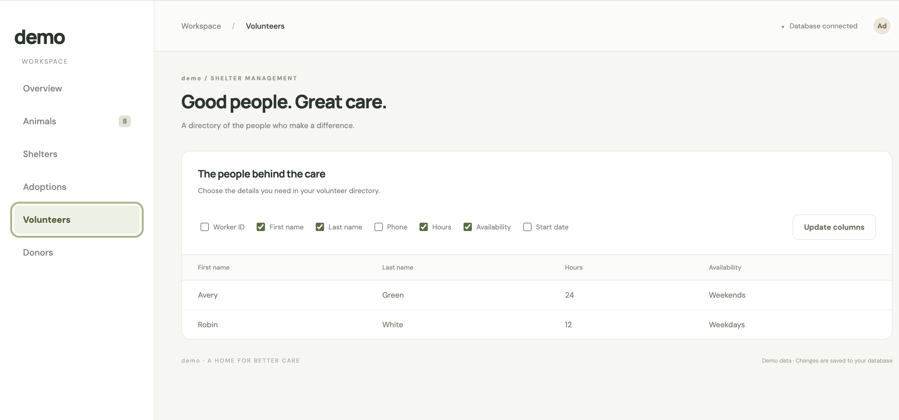
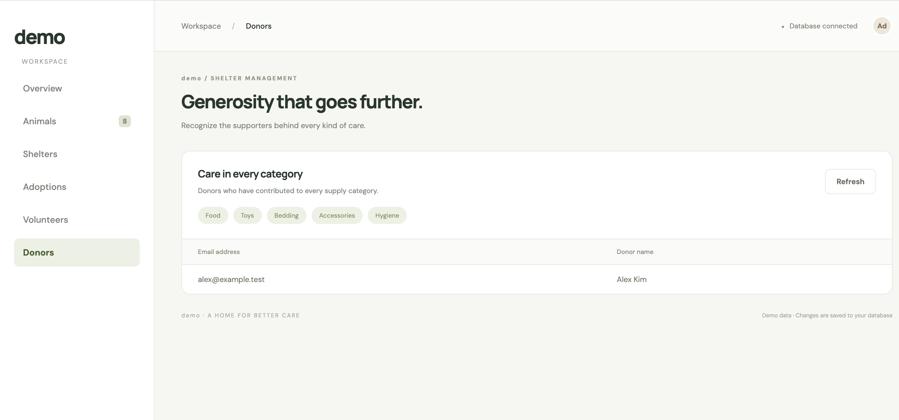

# Animal Shelter Management Program

A full-stack web application designed to efficiently manage operations, animal records, and adoptions for animal shelters and wildlife rescue organizations.

## Project Overview
This project is a comprehensive Database Management System (DBMS) that handles the complex data relationships in animal rescue operations. It provides a user-friendly web interface connected to a database, allowing staff to perform CRUD operations, track animal statuses, and execute complex queries for reporting and management purposes.

## Tech Stack
* **Frontend:** HTML5, CSS3, JavaScript
* **Backend:** Node.js, Express.js
* **Database:** Oracle SQL, `oracledb` , SQLite
* **Design & Architecture:** Entity-Relationship (ER) Modeling, BCNF Normalization

## Key Features
* **Data Management (CRUD):** Seamlessly Create, Read, Update, and Delete records for animals, rescue events, and adoption statuses through the web interface.
* **Complex Data Querying:** 
  * Advanced SQL queries including multi-table `JOIN`s to link animal profiles with medical or rescue history.
  * Aggregation functions (`GROUP BY`, `HAVING`) to generate statistics (e.g., number of rescues per species, monthly adoption rates).
  * Filter and search functionalities to locate specific animal records efficiently.
* **Optimized Database Architecture:** The relational schema was carefully mapped from an ER diagram and normalized up to **Boyce-Codd Normal Form (BCNF)** to eliminate data redundancy and ensure data integrity.
* **Basic security practices (sanitization) & basic error handling have been implemented.**

## How to Run Locally
### Using SQLite
npm start

### Using UBC Oracle Server 
#### MAC
* sh ./scripts/mac/db-tunnel.sh
* sh ./local-start.sh
#### Windows
* ./scripts/db-tunnel.cmd
* sh ./local-start.sh

### Prerequisites
* [Node.js](https://nodejs.org/) installed

* Access to an Oracle Database instance
* Oracle Instant Client (if required by your environment)

## Screenshots

