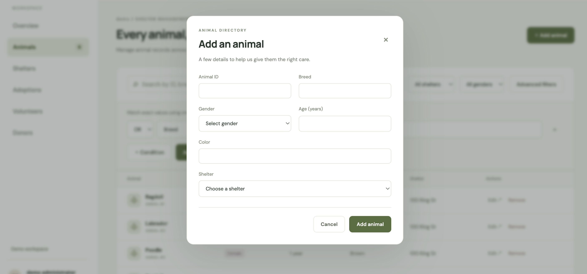
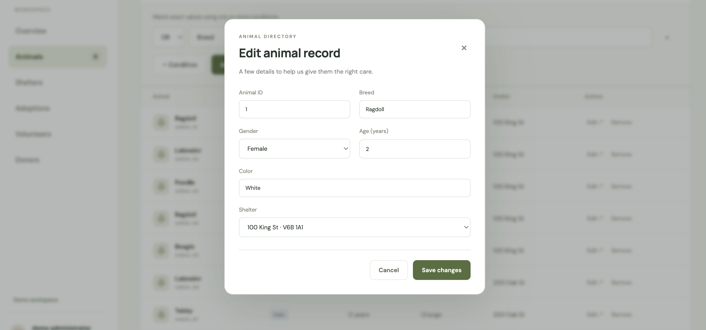
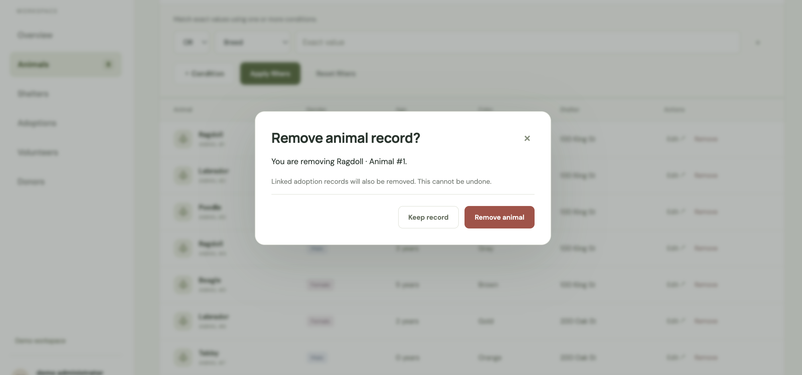

# Shelter DB

**An animal shelter admin application built with JavaScript, Node.js, Express, and SQL.**

Manage animal records, explore adoption history, and query shelter operations through a browser-based dashboard. Originally developed for UBC CPSC 304 using Oracle, the project now includes a persistent SQLite demo that runs without university database access.


## Features

| Area | What you can do |
| --- | --- |
| **Animal management** | Create, edit, and delete animal records. Search by gender, age, color, or shelter address. |
| **Shelter overview** | View animal counts by location, shelters with more than five staff, and shelters with above-average animal counts. |
| **Adoption lookup** | Search an adopter's name to retrieve linked animal records. |
| **Volunteer directory** | Select which fields to display, including names, availability, and volunteer hours. |
| **Donor reporting** | Find donors who have contributed to every tracked supply category. |

* The dashboard summarizes current database records. 
* Registration and editing are implemented for animals. The other sections provide lookup and reporting workflows.


## Engineering decisions

### Keeping the project runnable after losing Oracle access

The original application relied on a university-hosted Oracle database. When that access was no longer available, SQLite provided a way to keep the project demonstrable without a separate database server or credentials.

A shared database interface in [`db/index.js`](db/index.js) selects the backend. The SQLite adapter preserves the service's expected result format, allowing the existing Express routes to serve the same frontend. 
SQLite is the default. The Oracle connection path remains available through configuration.

### Turning relational queries into usable workflows

The application connects database concepts to shelter management questions:

| SQL concept | Application use |
| --- | --- |
| `JOIN` | Link adopters to adoption records and animals; combine volunteer and worker details. |
| Projection | Return the volunteer columns selected in the interface. |
| `GROUP BY` | Count animal records by breed. |
| `HAVING` | Identify shelters with more than five staff members. |
| Nested aggregation | Compare a shelter's animal count with the average among shelters that have animal records. |
| Relational division | Use nested `NOT EXISTS` queries to identify donors covering every supply category. |

### Basic Security Practices
Used parameterized queries for selection operations to safely handle user input and help prevent SQL injection.

### Preserving data between demo sessions

SQLite stores records in `data/demo.sqlite`. First-run schema creation and sample data insertion happen in a transaction.

## Architecture

```text
HTML / CSS / JavaScript (public/scripts.js)
          │ HTTP requests
          v
Express routes        appController.js
          │
          v
SQL service (Queries)        appService.js
          │
          v
Database interface   db/index.js
          ├── SQLite adapter → local demo file
          └── Oracle connection pool → existing Oracle database
```

| Layer | Technology |
| --- | --- |
| Frontend | HTML, CSS, vanilla JavaScript, Fetch API |
| Backend | Node.js, Express |
| Database | SQLite via `node:sqlite`; Oracle via `oracledb` |
| Data modeling | Relational schema, BCNF & 3NF, ER diagram |


## Run locally

### Requirements
* Node.js 22.16 or newer 
* npm
* SQLite mode needs no Oracle account, tunnel, or separately installed database server.

### Steps
#### Using SQLite
```sh
git clone https://github.com/orego-jin/shelter-db.git
cd shelter-db
npm ci
npm start
```
#### Using UBC Oracle
``` sh
sh ./scripts/mac/db-tunnel.sh
sh ./local-start.sh
```
### Notes
* Runs at **http://localhost:65534**. 
* The first launch creates the database with three shelters, eight animals, volunteers, adopters, and donors. 
* Changes persist across restarts. 
* Stop the server with `Ctrl+C`.

### A short walkthrough

1. Open **Overview** to see the animal count and breed distribution.
2. In **Animals**, search for `Ragdoll`, or filter by a shelter. Add a record with an unused animal ID, then edit it.
3. In **Adoptions**, search for `Cindy` to see linked animal records.
4. In **Volunteers**, change the selected columns and click **Update columns**.
5. In **Donors**, find `Alex Kim`, whose sample donations cover all five categories.


### Optional configuration

Create a `.env` file in the project root if you want to override the defaults:

```dotenv
DB_MODE=sqlite
PORT=65534
SQLITE_PATH=./data/demo.sqlite
```

## More screenshots









