# Shelter DB
**A relational database web application that evolved from a university-hosted Oracle system into portable server-side and browser-based SQLite architectures.**


Shelter DB is an animal shelter management application for managing animal records, exploring adoption history, and querying shelter operations through an interactive dashboard.

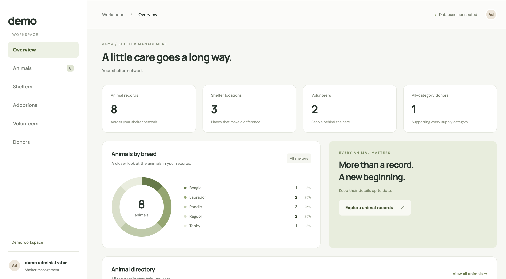


Originally developed for UBC CPSC 304 using Oracle, Node.js, and Express, the project depended on a university-hosted database that became unavailable after the course ended.

I extended the project by **redesigning its data architecture** in two stages:

- Migrated the database layer from Oracle to **server-side SQLite**, preserving the existing Node.js/Express architecture while removing the dependency on university infrastructure.

- Built a **browser-based SQLite** version using WebAssembly (sql.js), moving SQL execution into the browser so the application can run as a static interactive demo without a backend server.

The browser version also supports database **export and import**, allowing users to download their modified SQLite database and restore it in a later session without server-side storage.

## Key Engineering Highlights

* Migrated an existing relational application from Oracle to SQLite while preserving application workflows.

* Maintained separate database adapters for different execution environments.
    * public_oracle_version
    * public_sqlite_version
    * public_serverless_version
* Redesigned the application from a traditional client-server architecture into a browser-only SQLite/WebAssembly demo.

* Replaced backend API requests with direct browser-side database operations.

* Implemented SQLite database export/import for persistence across browser sessions.

* Applied relational database concepts including JOIN, projection, aggregation, nested aggregation, and relational division.

* Used parameterized queries when handling user-provided selection values to reduce SQL injection risk.

* Designed the relational schema using normalization principles including 3NF and BCNF.

## Architecture Adaptations
The project evolved through three architectures as its deployment requirements changed.

### 1. Original Course Architecture: Oracle + Node.js/Express

```text
Browser 
   ↓ HTTP

Node.js / Express 
   ↓
Controller 
   ↓
Service 
   ↓ 
   
UBC-hosted Oracle Database
```

Built as the original CPSC 304 project, this version demonstrates relational database design and SQL operations through a traditional client-server architecture.

### 2. Portable Backend Version: SQLite + Node.js/Express

```text
Browser 
   ↓ HTTP

Node.js / Express 
   ↓
Controller 
   ↓
Service Layer 
   ↓
SQLite Database File (data/demo.sqlite)
```

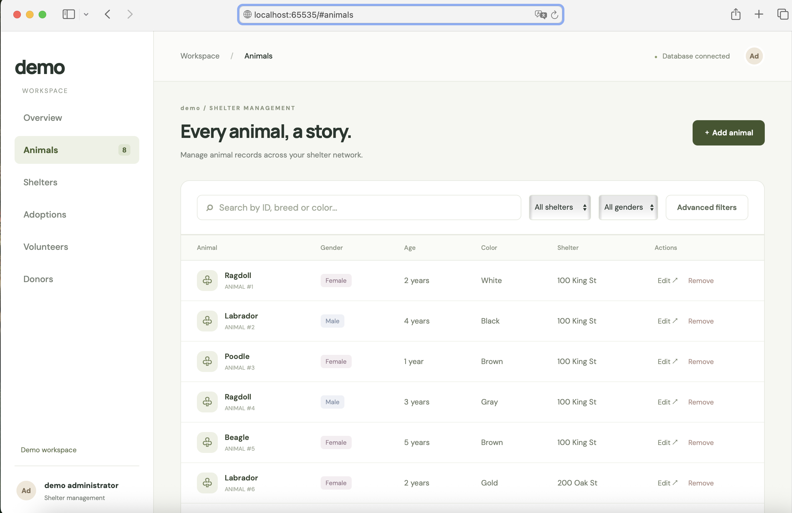

After university Oracle access ended, I migrated the database layer to SQLite.

This preserved the existing application structure while removing the dependency on external university infrastructure. Database changes are stored in a local .sqlite file and persist across server restarts.


### 3. Browser Demo — SQLite WebAssembly

```text
Browser
   │
   ├── HTML / CSS / JavaScript
   │
   ├── Application Logic
   │
   └── SQLite via WebAssembly (sql.js)
                 │
                 ▼
          In-memory SQLite DB
                 │
           Export / Import
                 ▼
          Local .sqlite file
```


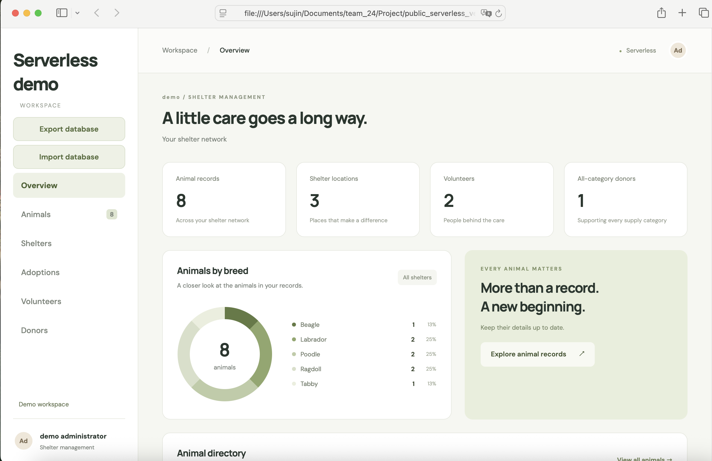


For the portfolio demo, I further redesigned the application so that SQL executes directly inside the browser using SQLite compiled to WebAssembly.

The frontend no longer depends on the Express API for database operations, allowing the demo to be deployed as static files.

Each session starts with an independent sample database. Changes remain in memory while the page is open, and users can export the database as a .sqlite file and import it later to continue working with their saved data.


### What This Development Demonstrates

Rather than replacing the original implementation, the three versions demonstrate different deployment architectures and their trade-offs:

- **Oracle + Node.js:** traditional web application architecture with a remotely hosted relational database
- **SQLite + Node.js:** portable application with persistent local database storage
- **SQLite WebAssembly:** static, browser-based demo optimized for accessibility and ease of deployment

Through this process, I gained practical experience separating the roles of the frontend, web server, application layer, database engine, and persistent storage, while adapting an existing application to different deployment constraints.

| Aspect | Oracle | Server-side SQLite | Browser-based SQLite |
|---|---|---|---|
| SQL execution location | UBC database server (Oracle) | Node.js process | Visitor’s browser |
| Data storage | UBC database storage | `.sqlite` file on the server | Browser memory / exported .sqlite |
| Persistence after restart or page reload | Retained in the database (Database-managed) | Retained as long as the database file is preserved (Persistent file)  | Export/import required |
| Data sharing between users of the same deployment | Supported | Supported | Not shared by default |
|Backend required	| Yes	|Yes	|No |
| Development goal | Original course project environment | Portable full-stack app | Zero-backend interactive demo |


## Appplication Features

| Area | What you can do |
| --- | --- |
| **Animal management** | Create, edit, and delete animal records. Search by gender, age, color, or shelter address. |
| **Shelter overview** | View animal counts by location, shelters with more than five staff, and shelters with above-average animal counts. |
| **Adoption lookup** | Search an adopter's name to retrieve linked animal records. |
| **Volunteer directory** | Select which fields to display, including names, availability, and volunteer hours. |
| **Donor reporting** | Find donors who have contributed to every tracked supply category. |
| **Database backup** | Export the current browser database as a `.sqlite` file and import it later to restore saved changes. |

* The dashboard summarizes current database records. 
* Registration and editing are implemented for animals. The other sections provide lookup and reporting workflows.


### Advanced SQL and Relational Queries

The application goes beyond basic CRUD operations and uses relational queries to answer shelter-management questions.

| SQL concept | Application use |
| --- | --- |
| `JOIN` | Link adopters to adoption records and animals; combine volunteer and worker details. |
| Projection | Return the volunteer columns selected in the interface. |
| `GROUP BY` | Count animal records by breed. |
| `HAVING` | Identify shelters with more than five staff members. |
| Nested aggregation | Compare a shelter's animal count with the average among shelters that have animal records. |
| Relational division | Use nested `NOT EXISTS` queries to identify donors covering every supply category. |

### Basic Security Practices
User-provided values are passed through parameterized SQL queries rather than concatenated directly into SQL statements, reducing the risk of SQL injection.

## Run locally

### Requirements
* Node.js 22.16 or newer 
* npm
* SQLite mode needs no Oracle account, tunnel, or separately installed database server.

### Original Oracle version
The original course version requires UBC Oracle credentials (.env) and network access and is retained for reference.
``` sh
sh ./scripts/mac/db-tunnel.sh
sh ./local-start.sh
```

### Server-side SQLite Version
1. Create a .env file:

```
DB_MODE=sqlite
PORT=65534
SQLITE_PATH=./data/demo.sqlite
```
2. Run the application:

```
git clone https://github.com/orego-jin/shelter-db.git
cd shelter-db
npm ci
npm start
```
### Browser-side SQLite Version (Serverless)
Clone the repository:
```
git clone https://github.com/orego-jin/shelter-db.git
```
Then open public_serverless_version/index.html directly in your browser.


## More screenshots

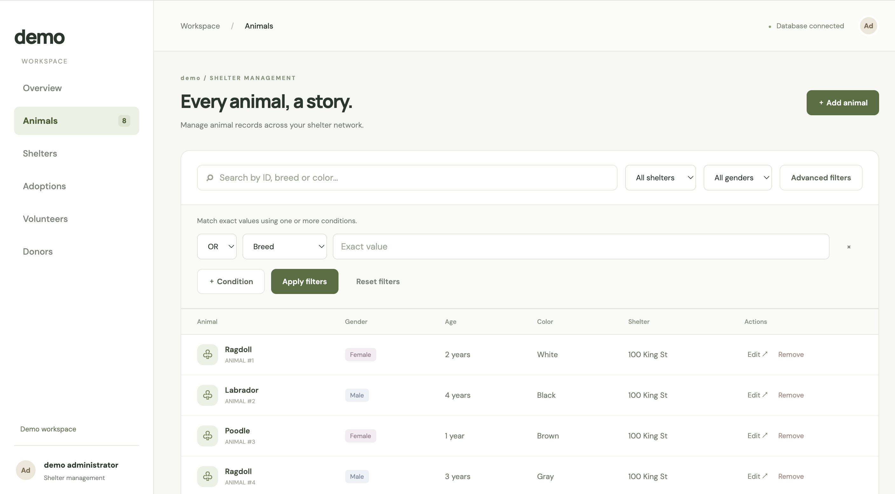

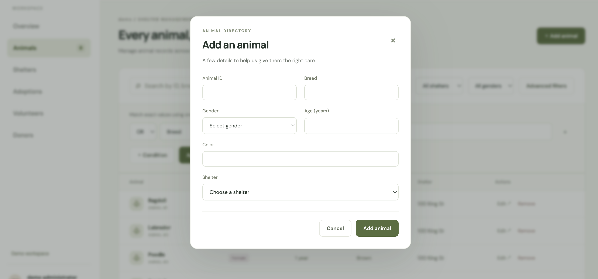

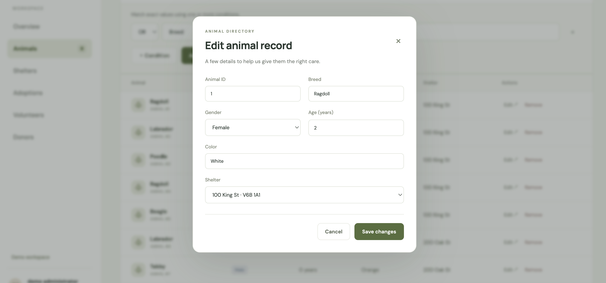

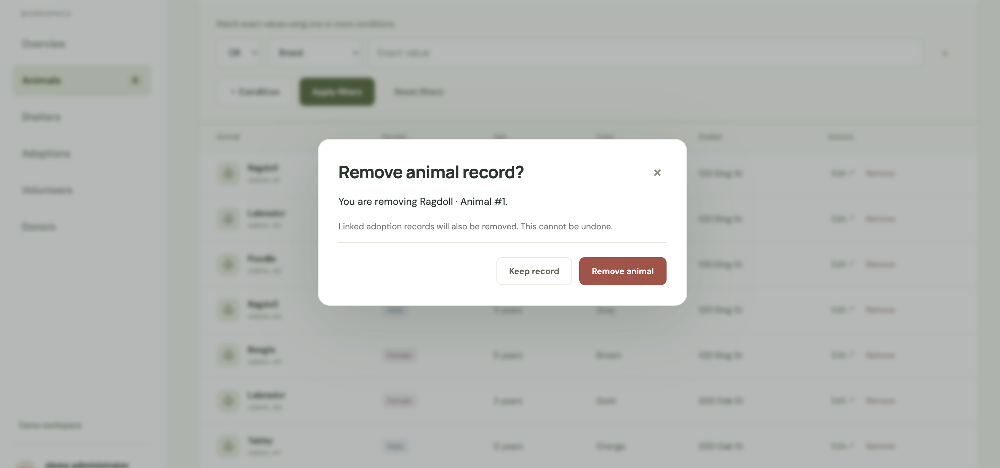

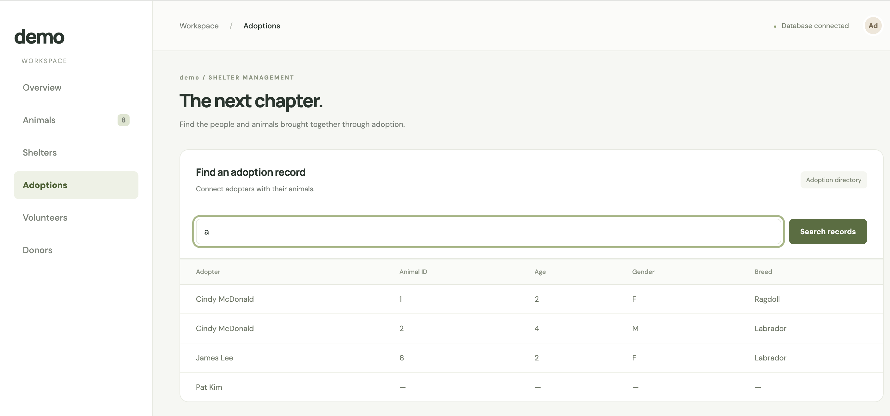

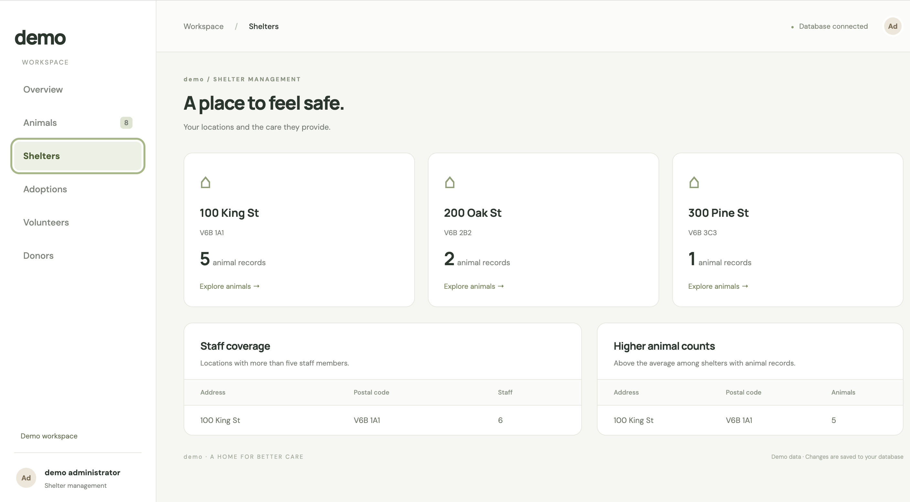

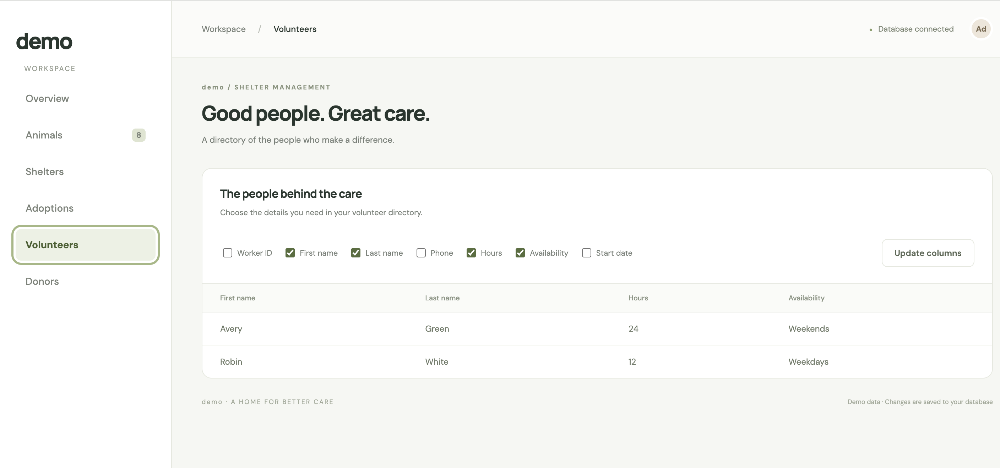

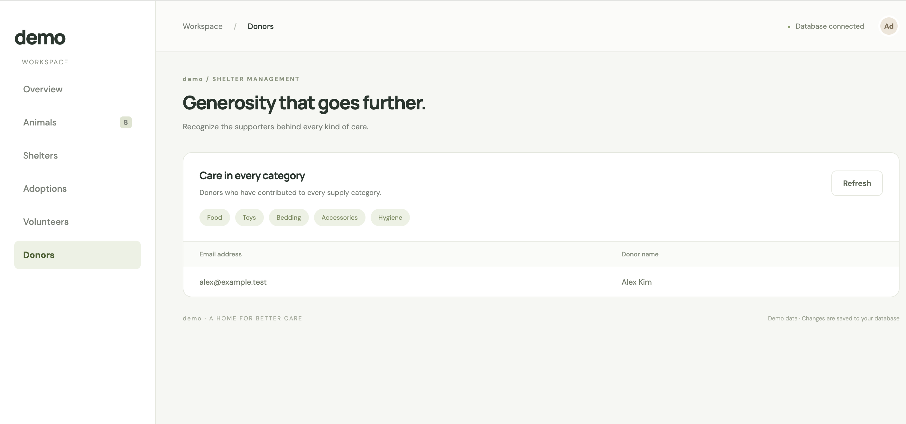
